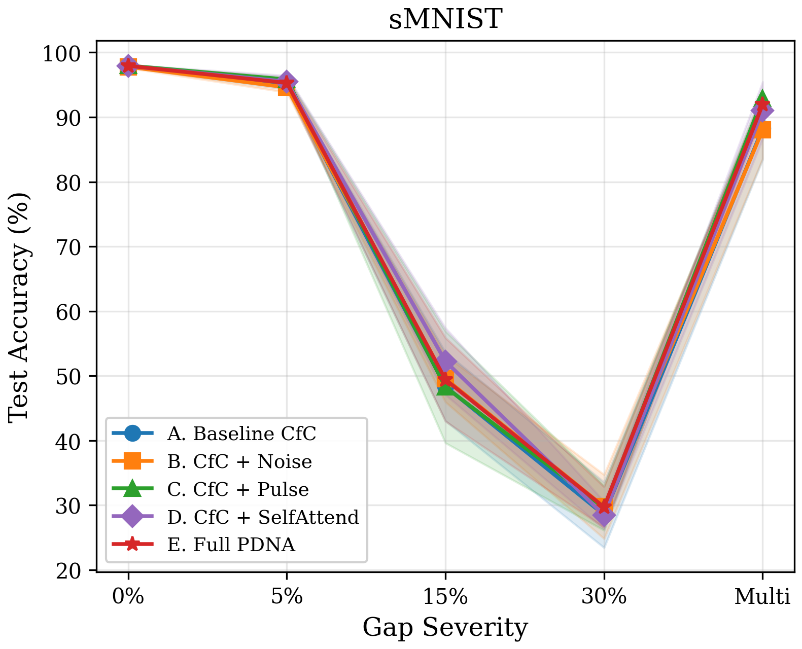
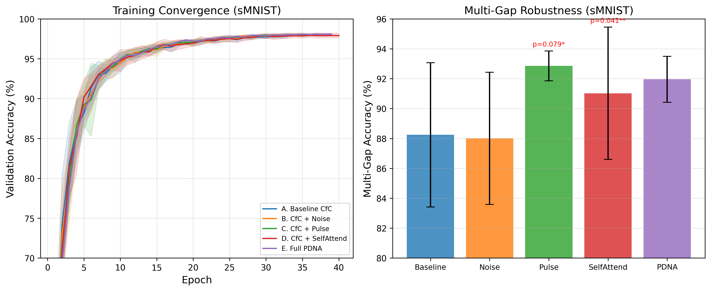

# PDNA: Pulse-Driven Neural Architecture

**A neural network with an intrinsic, self-sustaining oscillatory dynamic ("pulse") that maintains useful internal state across temporal gaps in input.**

Built on [CfC (Closed-form Continuous-time)](https://arxiv.org/abs/2106.13898) recurrent networks, augmented with learnable oscillatory dynamics and state-dependent self-attention.

> **Paper:** [`paper/main.tex`](paper/main.tex) — full arXiv-ready manuscript with statistical analysis

## The Idea

Current sequence models are fundamentally **stateless between inference steps** — when input stops, internal state freezes or decays. PDNA adds a continuous internal "heartbeat" that keeps the hidden state evolving even when input is absent:

```
τ(x) · dh/dt = -h + f(h, x; θ) + α · pulse(t, h) + β · self_attend(h)

pulse(t, h) = A · sin(ω · t + φ(h))      # learnable oscillation
self_attend(h) = W_self · σ(h)            # recurrent self-attention
```

The pulse gives the model (1) an internal sense of elapsed time, (2) active state evolution during input gaps, and (3) a temporal scaffold bridging discontinuities.

## Key Results (v5 — 5 seeds, sMNIST)

**5-variant ablation study** on sequential MNIST, evaluated under the **Gapped evaluation protocol** (input gaps at test time):

| Variant | Test Acc | Multi-Gap Acc | Degradation (0%→30%) |
|---------|----------|--------------|----------------------|
| A. Baseline CfC | 97.82 ± 0.12% | 88.24 ± 4.83% | 69.31 ± 5.02% |
| B. CfC + Noise | 97.78 ± 0.20% | 88.01 ± 4.42% | 68.00 ± 4.78% |
| C. CfC + Pulse | **97.96 ± 0.14%** | **92.86 ± 1.00%** | 68.38 ± 3.57% |
| D. CfC + SelfAttend | 97.89 ± 0.21% | 91.02 ± 4.43% | 69.43 ± 2.17% |
| E. Full PDNA | 97.93 ± 0.16% | 91.96 ± 1.54% | 68.21 ± 3.05% |

<p align="center">
  
</p>

### Statistical Highlights

- **Pulse wins 5/5 seeds** on multi-gap (consistent improvement)
- **SelfAttend vs Baseline multi-gap**: +2.78%, **p = 0.041** (significant at p < 0.05)
- **Pulse vs Noise gap-5%**: +1.22%, **p = 0.013** (significant at p < 0.05)
- **Pulse vs Noise multi-gap**: +4.85%, p = 0.079, **Cohen's d = 1.05** (large effect)
- **Structured > Random** confirmed: noise control provides no benefit
- Learned α grows from 0.01 → **0.66** (model actively uses the pulse)
- Learned ω spans [0.06, 10.02] (diverse frequency spectrum)
- Minimal overhead: +38% parameters, only **5% wall-time increase**

<p align="center">
  
</p>

## Architecture Variants

| Variant | Pulse | Self-Attend | Purpose |
|---------|:-----:|:-----------:|---------|
| A. Baseline CfC | | | Control |
| B. CfC + Noise | random | | Is structure needed, or just any perturbation? |
| C. CfC + Pulse | ✓ | | Oscillation alone |
| D. CfC + SelfAttend | | ✓ | Self-attention alone |
| E. Full PDNA | ✓ | ✓ | Combined architecture |

## Project Structure

```
src/pdna/
├── models/
│   ├── pulse_cfc.py       # Core PulseCfC implementation
│   ├── pulse_ltc.py       # Original PulseLTC cell
│   ├── baseline_ltc.py    # Baseline model (Variant A)
│   ├── noise_ltc.py       # Noise control (Variant B)
│   └── variants.py        # Factory for all variants
├── data/
│   ├── gapped.py          # Gapped evaluation benchmark
│   └── ...                # Dataset loaders
├── training/
│   ├── trainer.py         # Training loop with early stopping
│   └── config.py          # Experiment config
└── analysis/
    ├── results.py         # Statistical analysis
    └── visualize.py       # Visualization pipeline

paper/                     # LaTeX paper (arXiv-ready)
├── main.tex               # Full manuscript
├── references.bib         # 22 citations
├── tables_generated.tex   # Auto-generated result tables
└── figures/               # Publication-quality figures

scripts/
├── run_extended_ablation.py  # v5 experiment script (5 seeds × 3 tasks)
├── populate_paper.py         # Auto-generate LaTeX tables
└── generate_paper_figures.py # Generate paper figures
```

## Getting Started

```bash
# Clone
git clone https://github.com/Parassharmaa/pdna.git
cd pdna

# Install (requires uv — https://docs.astral.sh/uv/)
uv sync

# Run tests
uv run pytest

# Run experiments (requires GPU)
uv run python scripts/run_extended_ablation.py

# Generate paper tables and figures
uv run python scripts/populate_paper.py
uv run python scripts/generate_paper_figures.py
```

## Gapped Evaluation Protocol

The **Gapped** evaluation tests temporal robustness by zeroing out portions of the input sequence at test time:

| Gap Level | Description |
|-----------|-------------|
| 0% | Standard evaluation (no gaps) |
| 5% | 5% of timesteps zeroed — mild interruption |
| 15% | 15% zeroed — moderate interruption |
| 30% | 30% zeroed — severe interruption |
| Multi-gap | Multiple scattered gaps throughout sequence |

**Degradation** = (Gap 0% accuracy) − (Gap 30% accuracy). Lower is more robust.

## Experiment Status

- **sMNIST**: Complete (5 variants × 5 seeds, full gap evaluation)
- **psMNIST**: In progress (784-step pixel-by-pixel sequences)
- **sCIFAR-10**: Queued (1024-step color sequences)

## Hypotheses Tested

| Hypothesis | Result |
|-----------|--------|
| **H1** (Gap Robustness): Pulse models maintain more info across gaps | **Supported** — Pulse multi-gap 92.86% vs Baseline 88.24% (+4.62 pp) |
| **H2** (Structured > Random): Pulse beats matched noise control | **Supported** — Pulse vs Noise: p=0.013 on gap-5%, d=1.05 on multi-gap |
| **H3** (Active Utilization): Model learns to use the pulse | **Supported** — α grows 0.01→0.66, diverse ω spectrum |

## Tech Stack

- Python 3.10+, managed with [uv](https://docs.astral.sh/uv/)
- [PyTorch](https://pytorch.org/) 2.x
- [ncps](https://github.com/mlech26l/ncps) (Neural Circuit Policies) for CfC base
- [torchdiffeq](https://github.com/rtqichen/torchdiffeq) for ODE solving

## License

MIT
