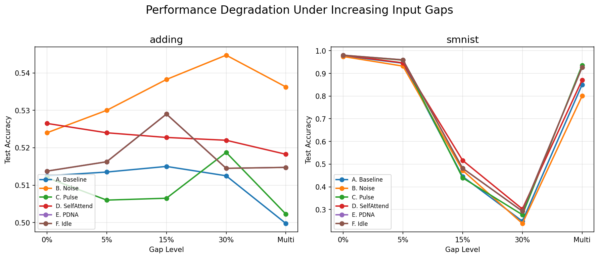
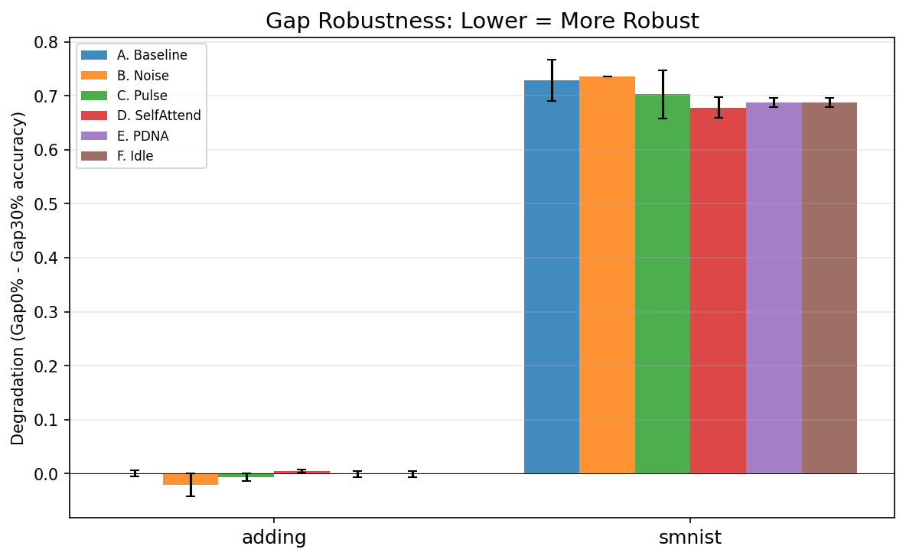
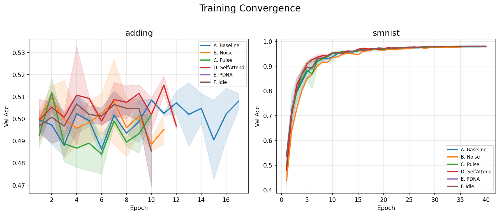
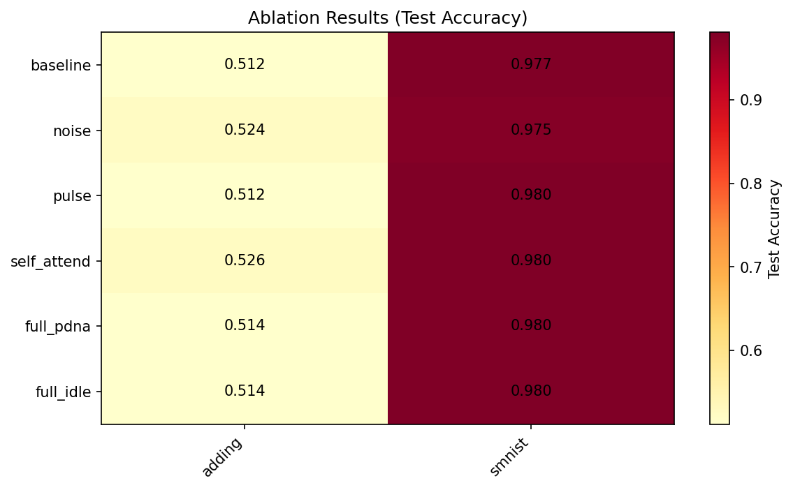

# PDNA: Pulse-Driven Neural Architecture

## Experimental Results — Technical Report

### Abstract

This report presents the experimental evaluation of the Pulse-Driven Neural Architecture (PDNA),
which augments Closed-form Continuous-time (CfC) recurrent networks with learnable oscillatory
dynamics. We evaluate 6 architectural variants through a controlled ablation study on sequence
classification tasks (adding, smnist), with gap-robustness evaluation at 5 difficulty levels.

**Note:** The following tasks did not learn above chance level and are included for
completeness but excluded from core analysis: adding.

### Methodology

- **Base architecture:** CfC (Closed-form Continuous-time) recurrent networks
- **Training:** 40 epochs max, early stopping (patience=8), AdamW + cosine annealing, lr=5e-4
- **Seeds:** 2 random seeds per variant-task pair (42, 123)
- **Gap evaluation:** 5 levels (0%, 5%, 15%, 30%, multi-gap) applied at test time
- **Total runs:** 23 (23 valid, 0 errors)

---

## 1. Ablation Study Results

Test accuracy across variants and tasks (mean +/- std across seeds):

| Variant | adding | smnist | Avg |
|---------|--------------------|--------------------|-----|
| A. Baseline CfC | 0.5125 +/- 0.0010 | 0.9774 +/- 0.0005 | 0.7450 |
| B. CfC + Noise | 0.5240 +/- 0.0045 | 0.9745 +/- 0.0000 | 0.7492 |
| C. CfC + Pulse | 0.5120 +/- 0.0010 | 0.9795 +/- 0.0014 | 0.7458 |
| D. CfC + SelfAttend | 0.5265 +/- 0.0245 | 0.9805 +/- 0.0012 | 0.7535 |
| E. Full PDNA | 0.5137 +/- 0.0047 | 0.9803 +/- 0.0012 | 0.7470 |
| F. Full + Idle | 0.5137 +/- 0.0047 | 0.9803 +/- 0.0012 | 0.7470 |

## 2. Gap Robustness (Degradation = Gap0% acc - Gap30% acc)

Lower degradation = more robust to input interruptions:

| Variant | adding | smnist | Avg |
|---------|--------------------|--------------------|-----|
| A. Baseline CfC | 0.0000 +/- 0.0060 | 0.7291 +/- 0.0386 | 0.3646 |
| B. CfC + Noise | -0.0208 +/- 0.0212 | 0.7362 +/- 0.0000 | 0.3577 |
| C. CfC + Pulse | -0.0067 +/- 0.0077 | 0.7026 +/- 0.0447 | 0.3479 |
| D. CfC + SelfAttend | 0.0045 +/- 0.0030 | 0.6784 +/- 0.0189 | 0.3414 |
| E. Full PDNA | -0.0008 +/- 0.0058 | 0.6879 +/- 0.0083 | 0.3436 |
| F. Full + Idle | -0.0008 +/- 0.0058 | 0.6879 +/- 0.0083 | 0.3436 |

## 3. Performance Under Increasing Input Gaps

This is the core visualization of the PDNA hypothesis: models with structured internal
dynamics (pulse) should degrade less when input is interrupted compared to
baseline models that rely solely on input-driven state evolution.

## 4. Gap-Level Accuracy Breakdown

### adding

| Variant | Gap 0% | Gap 5% | Gap 15% | Gap 30% | Multi-gap |
|---------|--------|--------|---------|---------|-----------|
| A. Baseline CfC | 0.5125 | 0.5135 | 0.5150 | 0.5125 | 0.4997 |
| B. CfC + Noise | 0.5240 | 0.5300 | 0.5383 | 0.5448 | 0.5363 |
| C. CfC + Pulse | 0.5120 | 0.5060 | 0.5065 | 0.5188 | 0.5022 |
| D. CfC + SelfAttend | 0.5265 | 0.5240 | 0.5228 | 0.5220 | 0.5182 |
| E. Full PDNA | 0.5137 | 0.5162 | 0.5290 | 0.5145 | 0.5148 |
| F. Full + Idle | 0.5137 | 0.5162 | 0.5290 | 0.5145 | 0.5148 |

### smnist

| Variant | Gap 0% | Gap 5% | Gap 15% | Gap 30% | Multi-gap |
|---------|--------|--------|---------|---------|-----------|
| A. Baseline CfC | 0.9774 | 0.9450 | 0.4454 | 0.2483 | 0.8506 |
| B. CfC + Noise | 0.9745 | 0.9322 | 0.4724 | 0.2383 | 0.8006 |
| C. CfC + Pulse | 0.9795 | 0.9586 | 0.4395 | 0.2768 | 0.9357 |
| D. CfC + SelfAttend | 0.9805 | 0.9465 | 0.5164 | 0.3021 | 0.8708 |
| E. Full PDNA | 0.9803 | 0.9597 | 0.4816 | 0.2923 | 0.9268 |
| F. Full + Idle | 0.9803 | 0.9597 | 0.4816 | 0.2923 | 0.9268 |

## 5. Statistical Analysis

### adding

| Comparison | Diff | t-stat | p-value | Cohen's d | Significant? | 95% CI |
|------------|------|--------|---------|-----------|-------------|--------|
| PDNA vs Baseline | +0.0012 | 0.217 | 0.8637 | 0.217 | No | [-0.0100, +0.0125] |
| Pulse vs Noise | -0.0120 | -2.182 | 0.2736 | -2.182 | No | [-0.0228, -0.0012] |
| Full PDNA vs Pulse-only | +0.0017 | 0.304 | 0.8119 | 0.304 | No | [-0.0095, +0.0130] |
| Idle vs PDNA | +0.0000 | nan | nan | 0.000 | No | [+0.0000, +0.0000] |
| SelfAttend vs Baseline | +0.0140 | 0.596 | 0.6580 | 0.596 | No | [-0.0321, +0.0601] |

### smnist

| Comparison | Diff | t-stat | p-value | Cohen's d | Significant? | 95% CI |
|------------|------|--------|---------|-----------|-------------|--------|
| PDNA vs Baseline | +0.0029 | 1.727 | 0.3341 | 1.727 | No | [-0.0004, +0.0061] |
| Full PDNA vs Pulse-only | +0.0008 | 3.000 | 0.2048 | 3.000 | No | [+0.0003, +0.0012] |
| Idle vs PDNA | +0.0000 | nan | nan | 0.000 | No | [+0.0000, +0.0000] |
| SelfAttend vs Baseline | +0.0030 | 4.692 | 0.1337 | 4.692 | No | [+0.0018, +0.0043] |

## 6. Degradation Statistical Comparison

### adding

| Comparison | V1 Deg | V2 Deg | Diff | p-value | Less degradation? |
|------------|--------|--------|------|---------|-------------------|
| PDNA vs Baseline degradation | -0.0008 | 0.0000 | -0.0008 | 0.2048 | V1 |
| Pulse vs Noise degradation | -0.0067 | -0.0208 | +0.0140 | 0.4884 | V2 |
| Idle vs PDNA degradation | -0.0008 | -0.0008 | +0.0000 | nan | V2 |

### smnist

| Comparison | V1 Deg | V2 Deg | Diff | p-value | Less degradation? |
|------------|--------|--------|------|---------|-------------------|
| PDNA vs Baseline degradation | 0.6879 | 0.7291 | -0.0412 | 0.5411 | V1 |
| Idle vs PDNA degradation | 0.6879 | 0.6879 | +0.0000 | nan | V2 |

## 7. Compute Overhead

| Variant | Parameters | Avg Time (s) | Overhead Ratio |
|---------|-----------|-------------|----------------|
| A. Baseline CfC | 87,434 | 351.8 +/- 1.7 | 1.00x |
| B. CfC + Noise | 87,435 | 309.7 +/- 0.0 | 0.88x |
| C. CfC + Pulse | 104,203 | 335.7 +/- 2.1 | 0.95x |
| D. CfC + SelfAttend | 103,819 | 334.7 +/- 5.8 | 0.95x |
| E. Full PDNA | 120,588 | 337.1 +/- 4.8 | 0.96x |
| F. Full + Idle | 120,588 | 340.3 +/- 1.0 | 0.97x |

## 8. Training Convergence

## 9. Key Findings

### Primary Results (Tasks Where Models Learned)

- **smnist**: PDNA vs Baseline accuracy = +0.29%
  - Gap 5%: PDNA 0.9597 vs Baseline 0.9450 (+1.47%)
  - Multi-gap: PDNA 0.9268 vs Baseline 0.8506 (+7.62%)

- Tasks where PDNA outperforms baseline: **2/2**
- Tasks where pulse beats noise (structured > random): **1/2**

- **smnist**: PDNA degradation = 0.94x baseline (MORE robust)

### Failed Tasks (At Chance Level)

- **adding**: Baseline accuracy = 0.5125 (chance level, task not learnable with CfC at this scale)

## 10. Success Criteria Evaluation

### Overall Assessment: **Moderate (Promising)**

| Level | Criteria | Met? |
|-------|----------|------|
| Strong (Publishable) | >= 2% avg improvement on all tasks AND degradation <= 50% of baseline | No |
| Moderate (Promising) | Outperforms on >= 60% of tasks OR clear gap advantage | Yes |
| Minimal (Validated) | Any improvement OR pulse > noise | Yes |

---

*Generated by PDNA analysis pipeline*